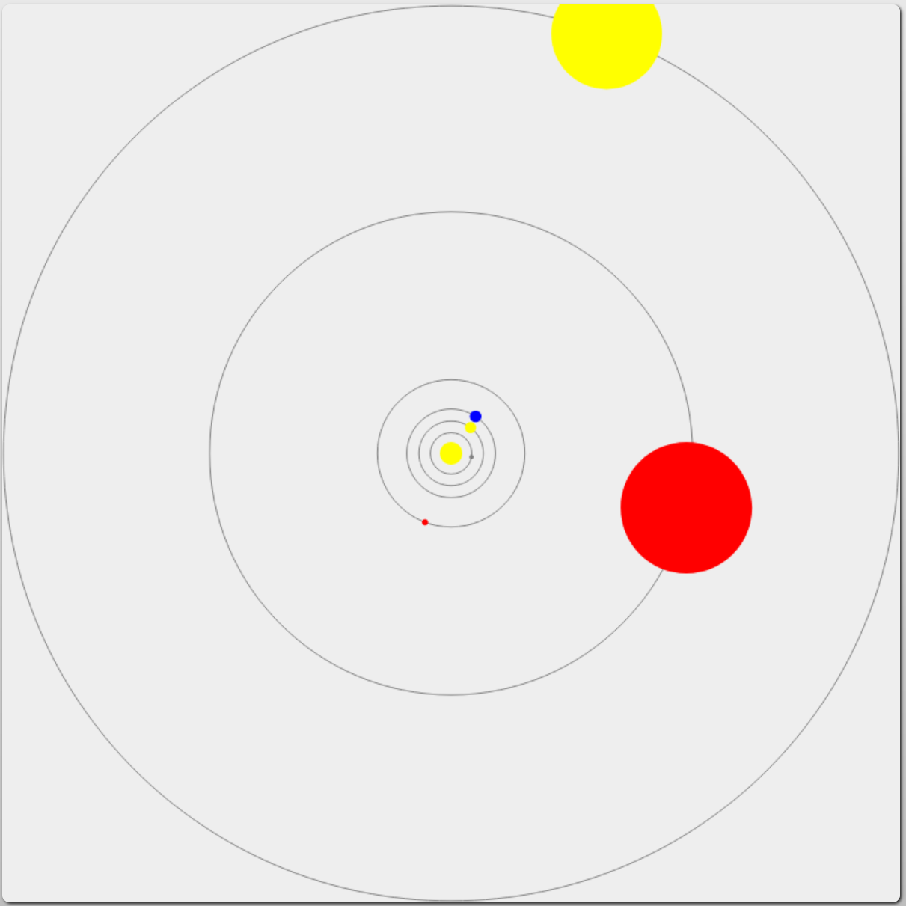

# Web Solar System

Simple example of how to draw an animation on a `<canvas>` HTML element using a simple solar system as an example. The planets orbit at periods proportional to their real orbits.

All of the code is in `simulations/solar.js`.

The resulting animation looks like:

